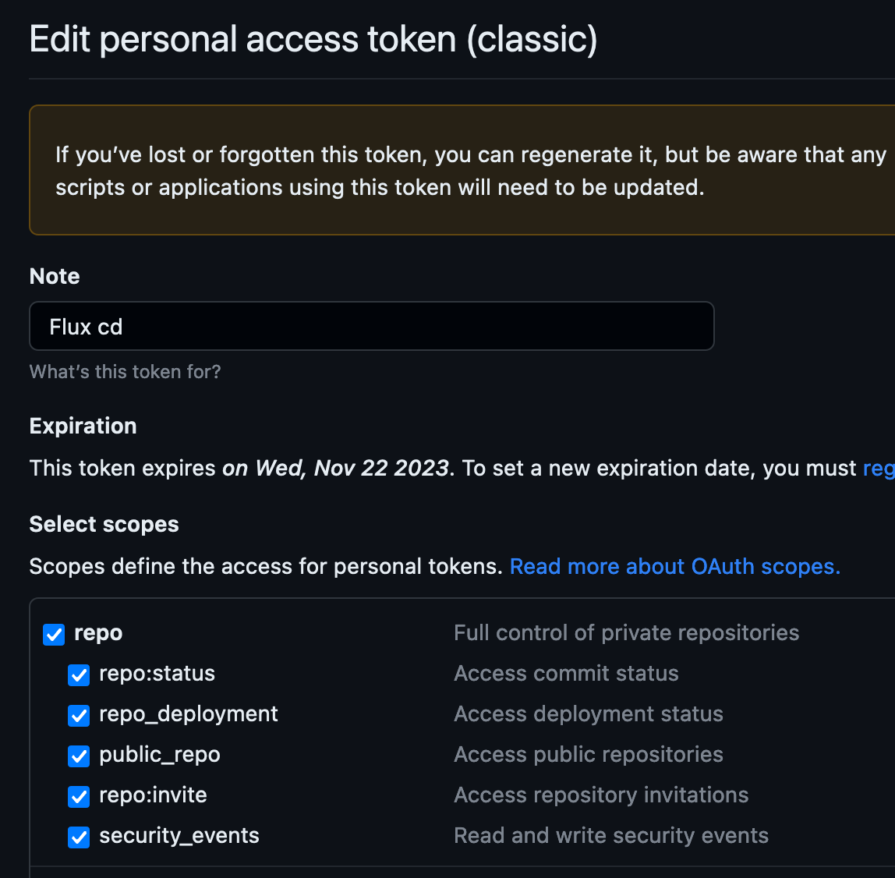

# Flux Workshop - Nerdearla 2023

Este repo es complementario al workshop "Introducción a GitOps con Flux", dado en la Nerdearla 2023.

## Requisitos

-   Kubernetes - Con [colima](https://github.com/abiosoft/colima#installation) o [kind](https://kind.sigs.k8s.io/docs/user/quick-start/) está bien
-   [kubectl](https://kubernetes.io/docs/tasks/tools/)
-   [flux](https://fluxcd.io/docs/installation/#install-the-flux-cli)
-   [gitops](https://docs.gitops.weave.works/docs/installation/weave-gitops/) CLI - (Opcional)
-   Github personal access token (PAT) - https://github.com/settings/tokens

### Mi setup

-   colima 0.5.5
-   kubectl 1.28.2
-   flux 2.1.1

## Crear cluster

```bash
colima start --kubernetes --cpu 4 --memory 8 --profile flux-demo

# kind
kind create cluster --name flux-demo
```

Check la creación del cluster

```bash
kubectl get nodes --watch
```

## Instalar Flux en el cluster

Primero vas a necesitar un token personal de Github con todos los permisos del scope `repo` - https://github.com/settings/tokens.



```bash
export GITHUB_USER=<github-user>
export GITHUB_TOKEN=<github-token>
```

### Chequear compatibilidad de flux con nuestro cluster

```bash
flux check --pre

► checking prerequisites
✔ Kubernetes 1.28.1+k3s1 >=1.25.0-0
✔ prerequisites checks passed
```

### Flux bootstrap

```bash
flux bootstrap github \
  --owner=$GITHUB_USER \
  --repository=flux-workshop-nerdearla \
  --branch=main \
  --path=./clusters/dev \
  --personal \
  --read-write-key
```

<details>
<summary>Output</summary>

```bash
► connecting to github.com
► cloning branch "main" from Git repository "https://github.com/marcorichetta/flux-workshop-nerdearla.git"
✔ cloned repository
► generating component manifests
✔ generated component manifests
✔ committed sync manifests to "main" ("128f2feb9053ed1863b3e5a8c14cf65488512b12")
► pushing component manifests to "https://github.com/marcorichetta/flux-workshop-nerdearla.git"
► installing components in "flux-system" namespace
✔ installed components
✔ reconciled components
► determining if source secret "flux-system/flux-system" exists
► generating source secret
✔ public key: ecdsa-sha2-nistp384 AAAAE2VjZHNhLXNoYTItbmlzdHAzODQAAAAIbmlzdHAzODQAAABhBNf54MZoM/zhM6DdYxJwyHf8PY2B6+VVobMzy+2kmpP0jSfFe4alVUbW0t/ljzeJyss5zj75Raw31z7LC7dH8LJZBzamVCmvX4g80S1EUzkbBLkhj0y4++YlLhcE51/19g==
✔ configured deploy key "flux-system-main-flux-system-./clusters/dev" for "https://github.com/marcorichetta/flux-workshop-nerdearla"
► applying source secret "flux-system/flux-system"
✔ reconciled source secret
► generating sync manifests
✔ generated sync manifests
✔ committed sync manifests to "main" ("0426a12bd7de1dc4186311a6bd5f8835d1340212")
```

</details>

Ver como se levanta flux

```bash
kubectl get pods -n flux-system -w
```

Traerse los manifiestos commiteados por flux

```bash
git pull

lsd --tree clusters
clusters
└── dev
    └── flux-system
        ├── gotk-components.yaml
        ├── gotk-sync.yaml
        └── kustomization.yaml
```

### Suspender flux

```bash
flux suspend source git flux-system -n flux-system
```

## Approach tradicional

Crear apps con kubectl

```bash
kubectl apply -R -f apps/dev

kubectl get svc -n podinfo

kubectl port-forward svc/frontend -n podinfo 8000:9898

kubectl get all -n podinfo

kubectl edit -n podinfo deploy/frontend

kubectl get all -n podinfo
```

## Gitops way

Crear namespace podinfo

```yaml
# apps/podinfo/namespace.yaml
apiVersion: v1
kind: Namespace
metadata:
    name: podinfo
```

---

Crear kustomization

```bash
flux create kustomization apps \
  --source=flux-system \
  --path="./apps/dev" \
  --prune=true \
  --interval=5m \
  --export > ./clusters/dev/apps.yaml
```

---

## Forzar reconciliación de flux

```bash
flux reconcile kustomization apps --with-source
```

## Dashboard

Flux UI - https://github.com/weaveworks/weave-gitops

**Crear kustomization para notificar a Flux del dashboard**

```bash
flux create kustomization infra \
--source=flux-system \
--path="./infrastructure" \
--prune=true \
--interval=1h \
--export > ./clusters/dev/infrastructure.yaml

# Port forward para ingresar localmente
kubectl port-forward svc/weave-gitops -n flux-system 9001:9001
```

## Image automation

**Agregar image automation y reflector controllers**

```bash
flux bootstrap github \
  --components-extra=image-reflector-controller,image-automation-controller \
  --owner=$GITHUB_USER \
  --repository=flux-workshop-nerdearla \
  --branch=main \
  --path=./clusters/dev \
  --personal
```

> Note ⚠️

`git pull` para traerse los cambios que pusheo `flux`

### Configurar image scanning

```bash
mkdir ./clusters/dev/images/

flux create image repository podinfo \
--image=ghcr.io/stefanprodan/podinfo \
--interval=5m \
--export > ./clusters/dev/images/podinfo-registry.yaml
```

Crear la policy a ser aplicada por Flux

```bash
flux create image policy podinfo \
--image-ref=podinfo \
--select-semver=">=5.0.x" \
--export > ./clusters/dev/images/podinfo-policy.yaml
```

### Image update automation

Conectar policy con app

```yaml
# deployment.yaml

spec:
    containers:
        - name: frontend
          image: ghcr.io/stefanprodan/podinfo:5.0.0 # {"$imagepolicy": "flux-system:podinfo"}
```

Crear update automation

```bash
flux create image update flux-system \
--interval=30m \
--git-repo-ref=flux-system \
--git-repo-path="./apps/dev" \
--checkout-branch=main \
--push-branch=main \
--author-name=fluxcdbot \
--author-email=fluxcdbot@users.noreply.github.com \
--commit-template="{{range .Updated.Images}}{{println .}}{{end}}" \
--export > ./clusters/dev/flux-system-automation.yaml
```

### Reproducibility

```bash
# Delete cluster
kind delete cluster -n flux-demo

# Recreate it
kind create cluser -n new-flux-demo

# Reboot flux
flux bootstrap github \
  --components-extra=image-reflector-controller,image-automation-controller \
  --owner=$GITHUB_USER \
  --repository=flux-workshop-nerdearla \
  --branch=main \
  --path=./clusters/dev \
  --personal \
  --read-write-key

kubectl port-forward svc/weave-gitops -n flux-system 9001:9001
```

## Sealed secrets - https://github.com/bitnami-labs/sealed-secrets

Problem: "I can manage all my K8s config in git, except Secrets."

Sealed Secrets: _"Hold my beer"_

```bash
mkdir ./clusters/dev/sealed-secrets

flux create source helm sealed-secrets \
    --url=https://bitnami-labs.github.io/sealed-secrets \
    --interval=10m \
    --export > ./clusters/dev/sealed-secrets/source.yaml

flux create helmrelease sealed-secrets \
    --interval=1h \
    --release-name=sealed-secrets-controller \
    --target-namespace=flux-system \
    --source=HelmRepository/sealed-secrets \
    --chart=sealed-secrets \
    --chart-version=">=1.15.0-0" \
    --crds=CreateReplace \
    --export > ./clusters/dev/sealed-secrets/helmrelease.yaml
```

### Git Push

### Notificaciones

**Crear provider**

```bash
mkdir ./clusters/dev/notifications

flux create alert-provider generic --type generic --export > ./clusters/dev/notifications/provider.yaml
```

**Crear alert**

```bash
flux create alert generic-alert \
  --event-severity info \
  --event-source Kustomization/flux-system \
  --provider-ref generic \
  --export > ./clusters/dev/notifications/alert.yaml
```

Simplest web server

```bash
while true; do (echo -ne "HTTP/1.1 200 OK\r\n\r\n"; cat) | nc -l -p 9999; done
```
